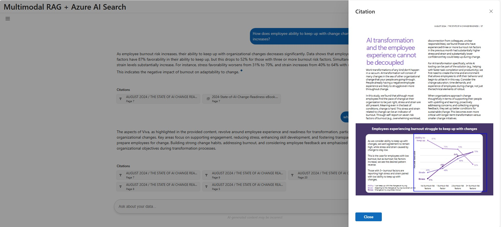

# Azure AI Search Multimodal RAG Demo
[](https://github.com/codespaces/new?hide_repo_select=true&ref=main&repo=984945158&skip_quickstart=true)

## Table of Contents

- [Azure AI Search Multimodal RAG Demo](#azure-ai-search-multimodal-rag-demo)
- [Azure AI Search Portal: Bring your own index and resources](#azure-ai-search-portal-bring-your-own-index-and-resources)
- [Getting Started](#getting-started)
   - [General Requirements](#general-requirements)
- [Environment setup](#environment-setup)
   - [Github codespaces](#github-codespaces)
   - [Local development setup (Windows or Linux)](#local-development-setup-windows-or-linux)
   - [Provision resources and deploy working app](#provision-resources-and-deploy-working-app)
   - [Debug app locally](#debug-app-locally)
   - [Bring your own data (supports .pdf only)](#bring-your-own-data-supports-pdf-only)
- [Azure Services Used for Deployment](#azure-services-used-for-deployment)
   - [Role Mapping for the Application](#role-mapping-for-the-application)
- [End-to-end app diagram](#end-to-end-app-diagram)
- [Troubleshooting](#troubleshooting)


Welcome to the **Azure AI Search Multimodal RAG Demo**. This repository contains the code for an application designed to showcase [multimodal](https://aka.ms/azs-multimodal) [Retrieval-Augmented Generation (RAG)](https://learn.microsoft.com/azure/search/retrieval-augmented-generation-overview) techniques using [Azure AI Search](https://learn.microsoft.com/azure/search/search-what-is-azure-search). This demo combines AI capabilities to create custom copilots / RAG applications that can query, retrieve, and reason over both text and image data.

With multimodal RAG, you can:

+ Extract relevant information from documents, screenshots, and visuals (like diagrams, charts, workflows, etc.).
+ Preserve and understand the relationships between entities in complex images to enable reasoning over structured content.
+ Generate grounded, accurate responses using Large Language Models (LLMs), integrating insights from both textual and visual modalities.

This demo is intentionally kept lean and simple, providing a hands-on experience with multimodal AI techniques. While not intended for production use, it serves as a powerful starting point for exploring how multimodal RAG can unlock new possibilities in building smarter, more context-aware applications.

Note that currently this sample doesn't have support for table extraction as a structure, but tables are extracted as plain text.

 
**Text citations**  
**Image citations**  

## Azure AI Search Portal: Bring your own index and resources
You can create an index using the AI Search portal's quick wizard for the multimodal scenario. Once the index is successfully created, you can integrate it with the app by running the following steps:

- Checkout a [code space](#azure-ai-search-multimodal-rag-demo) based on **main** branch
- Run ```az login --use-device-code```
- Run 
   ```pwsh
   scripts/portal-2-app.ps1 `
        -SearchIndexName "my-index" `
        -SearchServiceEndpoint "https://myservice.search.windows.net" `
        -StorageAccountUrl "https://myaccount.blob.core.windows.net" `
        -KnowledgeStoreContainerName "knowledgestore-artifacts" `
        -DataSourcesContainerName "data-sources" `
        -AzureOpenAiEndpoint "https://myopenai.openai.azure.com" `
        -AzureOpenAiDeploymentName "my-deployment" `
        -AzureOpenAiEndpointChatCompletionModelName "gpt-4o"
   ```

   Replace the placeholders (`<...>`) with your specific values. This script will configure the app to use the newly created index.  
   **Assumption**: For app simplicity, ensure 'KnowledgeStoreContainerName' and 'DataSourcesContainerName' must be from same storage account.
- Ensure your Azure Entra ID user object ID has been granted the necessary permissions for all required resources. See [Role Mapping for the Application](#role-mapping-for-the-application) for details.
- Run:
   ```bash
      src/start.sh
   ```

## Getting Started

### General Requirements  
To deploy and run this application, you will need the following:  
  
1. **Azure Account**  
   - If you're new to Azure, you can [sign up for a free Azure account](https://azure.microsoft.com/free) and receive some free credits to get started.   
   - Follow the guide to deploy using the free trial if applicable.  
  
2. **Azure Account Permissions**  
   - Your Azure account must have sufficient permissions to perform deployments. Specifically, you need:  
     - `Microsoft.Authorization/roleAssignments/write` permissions, such as those granted by the **Role Based Access Control (RBAC) Administrator**, **User Access Administrator**, or **Owner** roles.  
     - **Subscription-level permissions**. Alternatively, if you don’t have subscription-level permissions, you must be granted RBAC access for an existing resource group where you’ll deploy the application.  
     - `Microsoft.Resources/deployments/write` permissions at the subscription level.  
  
3. **Local Deployment Environment (Optional)**  
   - If a local deployment of the application is required, ensure you have one of the following operating systems set up:  
     - **Windows OS**  
     - **Linux OS**  
---  

## Environment setup

### Github codespaces
- Checkout a [code space](#azure-ai-search-multimodal-rag-demo) based on **main** branch

### Local development setup (Windows or Linux)
Install the below tools
- [Python 3.12.7](https://www.python.org/downloads/release/python-3127/)
- [Node.js > v.18](https://nodejs.org/)
- [az cli latest](https://learn.microsoft.com/en-us/cli/azure/install-azure-cli-windows?pivots=winget)
- [azd latest](https://learn.microsoft.com/en-us/azure/developer/azure-developer-cli/install-azd?tabs=winget-windows%2Cbrew-mac%2Cscript-linux&pivots=os-windows)
- [Powershell 7 (Windows and Linux)](https://github.com/powershell/powershell)

### Provision resources and deploy working app
- Run below commands (One time setup per environment)
  - Run ```az login --use-device-code```
  - Run ```azd auth login```
  - Run ```azd env new <YOUR_ENVIRONMENT_NAME>```
  - Run ```azd env set AZURE_PRINCIPAL_ID  <USER_OBJECT_ID>``` (This needs to user's object ID from Azure Entra ID. Alternate you can use command from your local development box ```az ad signed-in-user show --query id -o tsv``` )
  - Run ```azd up```. This command will
    - Provision the azure resources
    - Package the application
    - Injest data into azure search index
    - Deploy the working app to webApp services
  - NOTE: You might encounter provisioning errors on cohere. Please visit troubleshooting section for more details.
  - Once deployment succeeds, you can use the app.
  


NOTE: It may take 5-10 minutes after you see 'SUCCESS' for the application to be fully deployed. If you see a "Python Developer" welcome screen or an error page, then wait a bit and refresh the page.


### Debug app locally
- You need to ***provision all the resources*** before your start to debug app locally
- To launch the app locally, run the below command. The website will open automatically and be served at [localhost:5000](http://localhost:5000).

- **On Windows:**
   ```powershell
   src/start.ps1
   ```

- **On Linux:**
   ```bash
   src/start.sh
   ```

### Bring your own data (supports .pdf only)
- To index your own data,
   - Place pdf's under ```/data``` folder
   - Run ```scripts\prepdocs.ps1```
- You could also use different indexer strategies **["indexer-image-verbal", "self-multimodal-embedding"]**
- To create new index with a different strategy
  - Run ```azd set SEARCH_INDEX_NAME <new-index-name>```
  - **On Windows** Run ```scripts\prepdocs.ps1 -IndexerStrategy indexer-image-verbal ```
  - **On Linux** Run ```scripts\prepdocs.sh indexer-image-verbal ```
---

## Azure Services Used for Deployment  
The following Azure services are used as part of this deployment. Ensure you verify their billing and pricing details as part of the setup:  
  
1. **Azure AI Search**  
   - Service used for search functionalities within the application. Review [pricing](https://azure.microsoft.com/pricing/details/search/).
  
2. **Azure AI Document Intelligence**  
   - Service used for processing and extracting information from documents. Review [pricing](https://azure.microsoft.com/pricing/details/ai-document-intelligence/). 
  
3. Your provided:
   - **LLM Deployment**: For running the large language model (LLM) for verbalization and used by the RAG orchestrator. 
   - **Embedding Model Deployment**: Used for creating embeddings for vector search and other tasks.   
   - Ensure you check the pricing for both LLM and embedding deployments.
   - This sample currently supports gpt-4o, (AOAI) text-embedding-large, cohere-serverless-v3  
  
4. **Azure Blob Storage Account**  
   - Used to store extracted images and other data. Verify the pricing for storage and associated operations. Review [pricing](https://azure.microsoft.com/pricing/details/storage/blobs/).
  
5. **Azure App Service**  
   - Used to host and run the application in the cloud. Review [pricing](https://azure.microsoft.com/pricing/details/app-service/windows/). 

### Role Mapping for the Application  
The following table maps the roles used by the application to their respective functions:  
  
| **Role ID**                              | **Built-in Role Name**                   | **Granting Resource**                     | **Receiving Resource** | **Purpose**                                                                                                                              |
|------------------------------------------|------------------------------------------|-------------------------------------------|------------------------|------------------------------------------------------------------------------------------------------------------------------------------|
| `64702f94-c441-49e6-a78b-ef80e0188fee`   | **Azure AI Developer**                   | Azure AI Hub                              | User                   | Provides full create, read access to AI foundry projects.                                                                                |
| `a97b65f3-24c7-4388-baec-2e87135dc908`   | **Cognitive Services User**              | Azure AI services multi-service account   | Azure AI Search        | Provides read access to an Azure AI services multi-service account resource. (No write or manage permissions.)                             |
| `a97b65f3-24c7-4388-baec-2e87135dc908`   | **Cognitive Services User**              | Azure AI services multi-service account   | User                   | Provides read access to an Azure AI services multi-service account resource. (No write or manage permissions.)                             |
| `5e0bd9bd-7b93-4f28-af87-19fc36ad61bd`   | **Cognitive Services OpenAI User**       | Azure OpenAI                              | App Service            | Read-only access to models, files, and deployments in an Azure OpenAI resource. Allows running completion/embedding/image-generation calls. |
| `5e0bd9bd-7b93-4f28-af87-19fc36ad61bd`   | **Cognitive Services OpenAI User**       | Azure OpenAI                              | Azure AI Search        | Read-only access to models, files, and deployments in an Azure OpenAI resource. Allows running completion/embedding/image-generation calls. |
| `5e0bd9bd-7b93-4f28-af87-19fc36ad61bd`   | **Cognitive Services OpenAI User**       | Azure OpenAI                              | User                   | Read-only access to models, files, and deployments in an Azure OpenAI resource. Allows running completion/embedding/image-generation calls. |
| `8ebe5a00-799e-43f5-93ac-243d3dce84a7`   | **Search Index Data Contributor**        | Azure AI Search                           | App Service            | Provides full create, read, update, and delete access to all index data.                                                                 |
| `8ebe5a00-799e-43f5-93ac-243d3dce84a7`   | **Search Index Data Contributor**        | Azure AI Search                           | User                   | Provides full create, read, update, and delete access to all index data.                                                                 |
| `7ca78c08-252a-4471-8644-bb5ff32d4ba0`   | **Search Service Contributor**           | Azure AI Search                           | App Service            | Enables management of the Azure Cognitive Search service (e.g., create, scale, delete). Does not provide access to index data itself.    |
| `7ca78c08-252a-4471-8644-bb5ff32d4ba0`   | **Search Service Contributor**           | Azure AI Search                           | User                   | Enables management of the Azure Cognitive Search service (e.g., create, scale, delete). Does not provide access to index data itself.    |
| `ba92f5b4-2d11-453d-a403-e96b0029c9fe`   | **Storage Blob Data Contributor**        | Storage Account                           | App Service            | Allows read, upload, modify, and delete operations on blobs and containers within an Azure Storage account (data-plane only).             |
| `ba92f5b4-2d11-453d-a403-e96b0029c9fe`   | **Storage Blob Data Contributor**        | Storage Account                           | Azure AI Search        | Allows read, upload, modify, and delete operations on blobs and containers within an Azure Storage account (data-plane only).             |
| `ba92f5b4-2d11-453d-a403-e96b0029c9fe`   | **Storage Blob Data Contributor**        | Storage Account                           | User                   | Allows read, upload, modify, and delete operations on blobs and containers within an Azure Storage account (data-plane only).             |

## End-to-end app diagram


## Troubleshooting
- What is the region availability for Azure OpenAI service?  
  Please visit [available regions](https://learn.microsoft.com/azure/ai-services/openai/concepts/models?tabs=global-standard%2Cstandard-chat-completions#global-standard-model-availability)
- What is the region availability for Cohere Serverless?    
  Cohere serverless is supported only in [5 regions](https://learn.microsoft.com/azure/ai-foundry/how-to/deploy-models-serverless-availability#cohere-models)
- Deployment fails for 'Cohere' in marketplace subscription 
  - Ensure your subscription is supported or enabled for Marketplace deployment [Learn more](https://learn.microsoft.com/en-us/azure/ai-foundry/how-to/deploy-models-serverless?tabs=azure-ai-studio#prerequisites)
  - There is a known issue of conflict operation between Marketplace subscription and endpoint deployment. **Rerun deployment** to fix it

